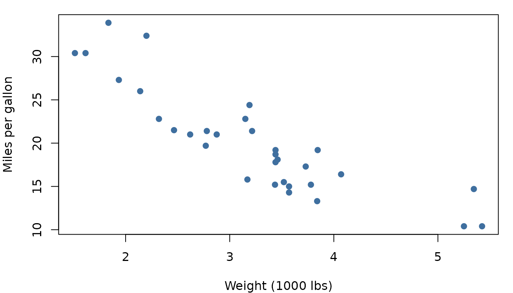

# Theme showcase

Use the **light switch** in the top-right of the navbar to flip between
light, dark, and auto modes. Every element on this page is styled for
both.

## Prose and inline elements

This is a normal paragraph of body text set in **Inter**. It mixes
*emphasis*, **strong emphasis**, a [link to
pkgdown](https://pkgdown.r-lib.org), and a bit of `inline_code()` to
show the muted-blue code chip. Headings are set in **Outfit** with
slightly tightened letter-spacing for a sleeker feel.

> Blockquotes get a muted-blue accent bar on the left, which reads
> cleanly against both the light off-white and the dark navy
> backgrounds.

### Lists

- An unordered list item
- Another item, with `inline code`
  - A nested item
  - One more nested item
- A final top-level item

1.  First ordered step
2.  Second ordered step
3.  Third ordered step

## Code blocks

Fenced code blocks are framed with a rounded border that matches the
rest of the page. The token colours come from the `arrow-light` / `nord`
syntax themes, which track the active colour mode:

``` r

# A short, plain example
nums <- rnorm(100, mean = 5, sd = 2)
summary(nums)
#>    Min. 1st Qu.  Median    Mean 3rd Qu.    Max. 
#> -0.2247  4.2878  5.1821  5.1416  6.2468 10.5108
```

A non-evaluated block, to show pure syntax highlighting:

``` r

fit <- lm(mpg ~ wt + cyl, data = mtcars)
coef(summary(fit))
```

## Tables

``` r

knitr::kable(head(mtcars[, 1:5]), caption = "The first few rows of `mtcars`.")
```

|                   |  mpg | cyl | disp |  hp | drat |
|:------------------|-----:|----:|-----:|----:|-----:|
| Mazda RX4         | 21.0 |   6 |  160 | 110 | 3.90 |
| Mazda RX4 Wag     | 21.0 |   6 |  160 | 110 | 3.90 |
| Datsun 710        | 22.8 |   4 |  108 |  93 | 3.85 |
| Hornet 4 Drive    | 21.4 |   6 |  258 | 110 | 3.08 |
| Hornet Sportabout | 18.7 |   8 |  360 | 175 | 3.15 |
| Valiant           | 18.1 |   6 |  225 | 105 | 2.76 |

The first few rows of `mtcars`. {.table}

A plain Markdown table renders the same way:

| Mode  | Background | Primary   |
|-------|------------|-----------|
| Light | `#fbfcfe`  | `#3f6f9f` |
| Dark  | `#0f141b`  | `#7ea8d6` |

## Figures

``` r

op <- par(mar = c(4, 4, 1, 1))
plot(mtcars$wt, mtcars$mpg,
    pch = 19, col = "#3f6f9f",
    xlab = "Weight (1000 lbs)", ylab = "Miles per gallon"
)
```



``` r

par(op)
```

## Buttons and emphasis

[Primary button](#) [Outline button](#)

That covers the elements you’ll meet most often in package
documentation.
